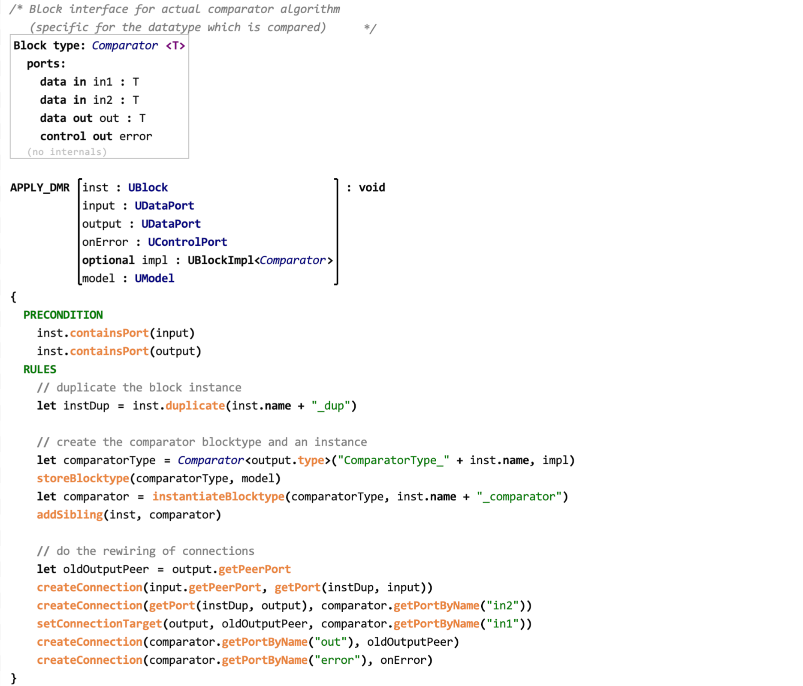
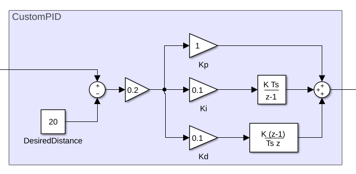
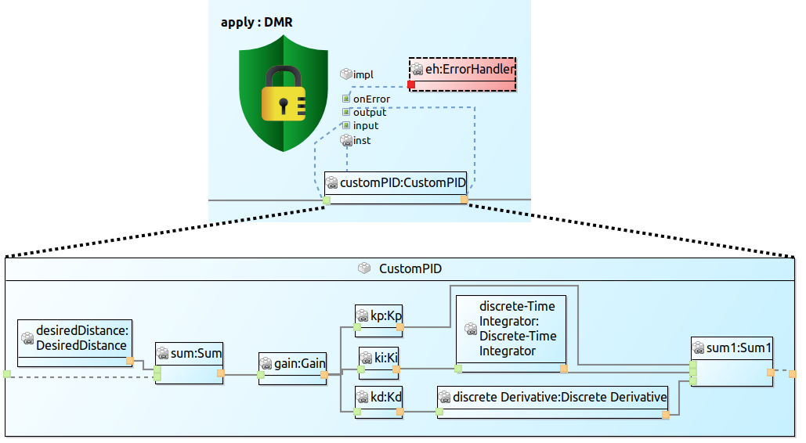
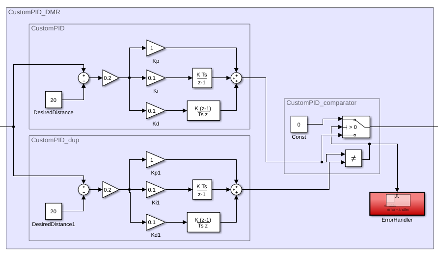

Here we give a small example for the application of a dual modular redundancy (DMR) pattern to a PID controller modeled in MATLAB&#174; / Simulink&#174;.

## DMR UTL Transformation

The following screenshot shows the UTL transformation for a simple DMR pattern used in this example.

The pattern requires several arguments to protect a block via the DMR pattern.
The first arguments are the block that is to be protected (*inst*) as well as the *input* and *output* ports of the block.
In addition, the pattern can be connected to an existing error handler via the *onError* port argument and requires an implementation for a comparator via the *impl* parameter.
The block type *Comparator\<T\>* defines the interface of the comparator.
The transformation script applies the DMR pattern by duplicating the function given by *inst*, distributing the input to both functions, and connecting the outputs to the comparator.
If the comparator receives the same values, it will forward the value. If the values differ, the given error handler will be called.

## Simulink PID controller

The following screenshot shows a part of a Simulink block model that will be used in this example.
It shows the expanded subsystem of a PID controller that will be protected via the showed DMR pattern.

## Analogous USF Model

With the help of a tool, we can now generate the analogous USF model of the Simulink model via a mapping.
The following image shows the same parts for he generated USF model.
The image also already contains a *SafetyPatternApplication* of the DMR pattern.
The parameters of the pattern are connected to model elements and are used as arguments in the transformation.

## Appling the Safety Pattern

To fully automate the application of the pattern, a suitable Simulink implementation for the comparator is required that conforms to the interface specified by *Comparator\<T\>*.
Unlike the UTL transformation, which can be used in different domains, the implementation of new components required for the safety pattern must be provided once for each domain, but can be reused for different patterns.
The following screenshot shows a simple comparator in a Simulink subsystem.

Using the provided comparator implementation, we can now apply the transformation to both the USF model and the Simulink model.
The following screenshot shows the resulting Simulink model with the DMR pattern applied.

------------------------------------------------------------

MATLAB and Simulink are registered trademarks of The MathWorks, Inc. See [mathworks.com/trademarks](https://mathworks.com/trademarks) for a list of additional trademarks.
