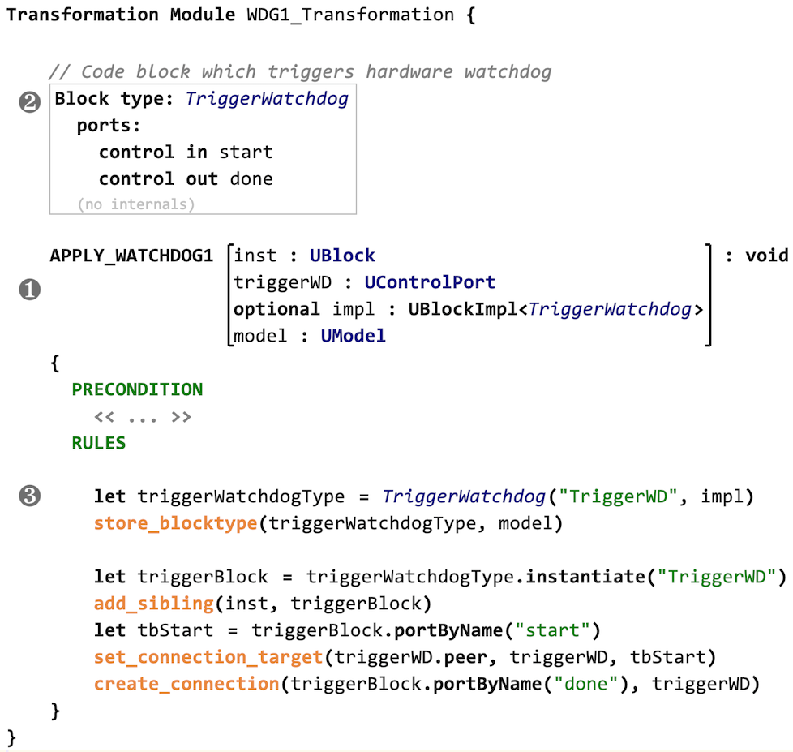

The USF transformation language (UTL) operates on the USF metamodel (aka *blockmodel*) and allows to define transformations. Executing a transformation on a USF blockmodel will automatically apply a safety mechanism to either models or code.

## Weaving as Model Transformation

The foundation for weaving functional safety mechanisms into models and code is a bidirectional mapping between these target domains and the blockmodel. Based on this mapping, any weaving mechanism can be defined as a model transformation on the blockmodel. The blockmodel-specific transformation language *UTL* provides a convenient way to specify mechanisms in terms of the blockmodel domain.

UTL is an imperative-style language, it's basic entity being a *transformation*. The language concepts can roughly be divided into the following parts:

- transformation signatures
- general features (variable definitions, control structures, function calls)
- operations on concepts from the blockmodel
- special concepts (e.g., a constructor for blocktypes)

By design, UTL can be expressed using a convenient textual concrete syntax, but can be enriched with more elaborate notational elements if the tool platform allows it (e.g., when using a projectional editor like [JetBrains MPS](https://www.itemis.com/en/it-services/methods-and-tools/mps?hsLang=en)). 

In order to allow a concise way of specifying transformations and at the same time provide the target users (i.e., mostly safety engineers) with a language which is easy to use also for non-developers, UTL is not a general-purpose transformation language (compared to e.g., ATL). The available concepts are restricted to what is required for specifying safety mechanisms.


## Example: UTL Transformation for a *Watchdog* safety mechanism

The following screenshot shows an example of a transformation specified in UTL: a watchdog safety mechanism. The example will be used to explain the UTL concepts in the following sections.




## Overview of UTL Concepts

This section gives an overview on the various concepts of the language.

### Expression language with types
UTL features an expression language with the usual primitive types (e.g., `boolean`, `integer`, `string`) and operations on these types. In addition, a subset of the block metamodel concepts are available as types in UTL, e.g., `Block`, `DataPort` and `ControlPort`.

### Transformation signatures
Calling a transformation resembles a function call. I.e., the transformation signature consists of a name, a set of named parameters with types and a return type (see item <span style="font-size:larger;">❶</span> in the example screenshot above). This signature serves as the transformation's interface to the annotations in the domain model.

Signatures might also include blocktype definitions (according to the block metamodel). E.g., the transformation depicted at item <span style="font-size:larger;">➋</span> in the example uses the blocktype `TriggerWatchdog`.

### Operations
The largest part of UTL is the set of operations on blockmodel concepts. These can be divided into two groups. The first group of operations are implicitly defined by the USF metamodel (e.g., getters and setters for attributes of concepts). The second group consists of helper operations which provide additional logic or shortcuts for typical patterns (e.g., `createConnection()` for creating new connection elements and linking them to the proper `Port` nodes).

For most operations there are two concrete syntaxes, either plain:

```
  op(p1, p2, ...)
```

or dot-notation:

```
  p1.op(p2, ...)
 ```

The two versions can easily be transformed into each other (syntactic sugar). 

### Blocktype constructors
A common task in USF transformations is the creation of new block structures, which is accomplished by creating a new `Blocktype` element. In order to avoid building these elements from scratch using the operations described above, UTL supports *constructor* syntax. A constructor call creates a new blocktype, using an existing one as a blueprint. This is shown for the `TriggerWatchdog` blocktype in the example (item <span style="font-size:larger;">➌</span> in the screenshot).

The blueprint `Blocktype` can be defined using any USF metamodel editor. In the example, it has been defined using a textual syntax as part of the transformation signature.

The first parameter of the constructor is the name of the new blocktype. With the second parameter a domain-specific implementation of type `BlockImpl<T>` can be provided.

### Abstracting from domain-specific details
The USF metamodel and the UTL are domain-agnostic, but in order to apply transformations to domain-specific models it is required to handle domain-specific details. The memento-like pattern based on `BlockImpl<T>` and the constructor syntax can be used to inject domain-specific behavior as implementation of the created blocktype. E.g., for the C domain this would be a C code snippet which adheres to the interface defined by the blocktype's ports.


## Transformation Engine for UTL

UTL allows to model safety mechanisms as domain-agnostic transformation scripts. The following section describes how these scripts can be executed.

### Executing transformations
In an environment for applying USF transformations to domain-specific models, the following building blocks are needed: a transformation script defined in UTL, an input model (in domain-specific and USF blockmodel representations), a library with domain-specific implementation details (e.g., glue code). The following diagram gives an overview, using C-code as example domain.

")

For execution of transformation scripts, there are different options:

- using an interpreter with a domain-specific back-end
- translating the input domain-model into a USF blockmodel and executing the transformation generically
- translating the transformation script into executable code (e.g., Java) which can be executed on a representation of the domain-specific model

The best option for the implementation of a UTL transformation engine depends on the tool environment where it has to integrate as well as on the target domain. Esp. for program code domains (e.g., C code) the mapping to USF concepts is not straightforward.

### Support for structural models

The mapping from USF models to target domains which represent hierarchically structured architectures with components and ports is quite straightforward. USF blocktypes and blocks will represent domain components, and port concepts can be mapped 1:1. Hierarchies are natively supported by USF as well. Therefore, the execution of UTL transformation scripts on these structures is easily possible. 

Typical industry-relevant domains from this category are SysML (and SysML-like proprietary models), AUTOSAR and Simulink.

### Support for program code, esp. C

In compilers and other code-related tools, program code (e.g., C) is represented as abstract syntax tree (AST). In order to map this domain to USF, elements of the AST have to be represented by USF blocks and other elements. USF has been designed to cover this, esp. by supporting dataflow and controlflow concepts. Despite this support the mapping between a C AST and USF block models is not straightforward.

In our reference implementation (see [SafetyWeaver](/tools/safetyweaver) page), a UTL interpreter with a domain-specific plug-in has been implemented. The C-domain plug-in creates the USF model from the input C code on the fly, starting from the annotated code elements (e.g., C functions or C blocks). The UTL interpreter will create new blocks and connections depending on the actual transformation scripts. In a post-processing step the resulting USF model is converted into C-AST elements and manifested as code. The control-flow connections on USF block level determine the order of the newly created C code blocks.
