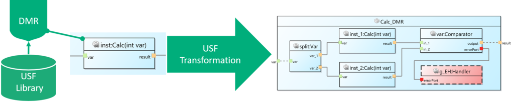
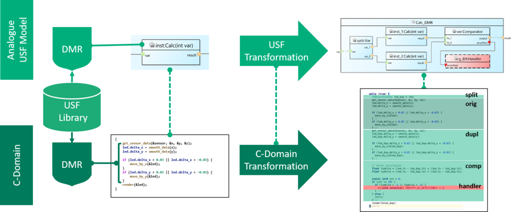

{}

Safety mechanisms can protect against safety hazards, e.g., caused by random hardware errors and can be integrated at different level of abstraction and stages of the software development of the desired functionality, for example, at model, source code, or binary level. We refer to the actual abstraction level where a safety mechanism is applied as “domain”. The optimal level of abstraction and modeling/programming language to integrate a particular safety mechanism depends on many aspects and is highly use-case specific. Nevertheless, these safety mechanisms can often be grouped into different types that share a general structure, independent of the use-case and even across different domains.

{}

{}

The Universal Safety Format (short: USF) enables the user to generate and weave application-specific safety mechanisms into different domains using one pattern description per safety mechanism type.
USF consists of the following two parts:
1. USF Metamodel: A domain-agnostic metamodel to describe the structure of functionality including the data and control flow.
2. USF Transformations: A transformation language to describe safety mechanism patterns and how to integrate them into USF-based models.
 

{}

{}

A safety mechanism library based on USF consists of transformation scripts and can be extended by adding new scripts. A safety mechanism from the library can be easily applied to a USF model by specifying elements inside the model that should be protected by the given mechanism and executing the transformation. The following image shows the application of a dual modular redundancy (DMR) mechanism on a USF component by duplicating the function and comparing the result of both.

For a detailed description of the USF metamodel see [Overview USF-Metamodel]( "Overview USF-Metamodel")

{}
{}

In order to use USF safety mechanisms in a specific domain, the transformation steps have to be interpreted for this domain context. This can be automated by integrating USF support in a domain-specific tool (e.g., a C IDE like Visual Studio Code or a SysML tool). There are many implementation options to achieve this, depending on the specific domain and existing tool infrastructure.
One option for USF support in a tool is to implement the following four steps:
1.	Mapping between the domain elements and USF elements.
2.	Interface to use the safety mechanism from USF library and to annotate them directly to domain elements using the mapping.
3.	Create a domain-specific USF transformation interpreter using the mapping.
4.	Interface for domain-specific implementation of the newly introduced components (e.g., comparator function, specific error handler)

The following image shows an example for the application of a DMR mechanism on a section of C code.  The C code is transformed by interpreting all transformation steps from the USF transformation script in the C domain (dark green), analogous to the transformation in the USF domain (light green). The newly added components “Comparator” and “Handler” are generated from provided code snippets and woven into the transformed code. 

For a detailed description of the USF transformations and how to integrate them into a tool see [Overview USF-Transformations]( "Overview USF-Transformation").

{}

