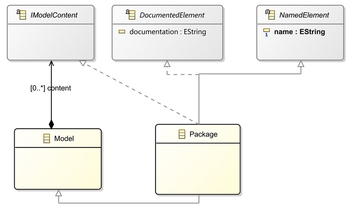
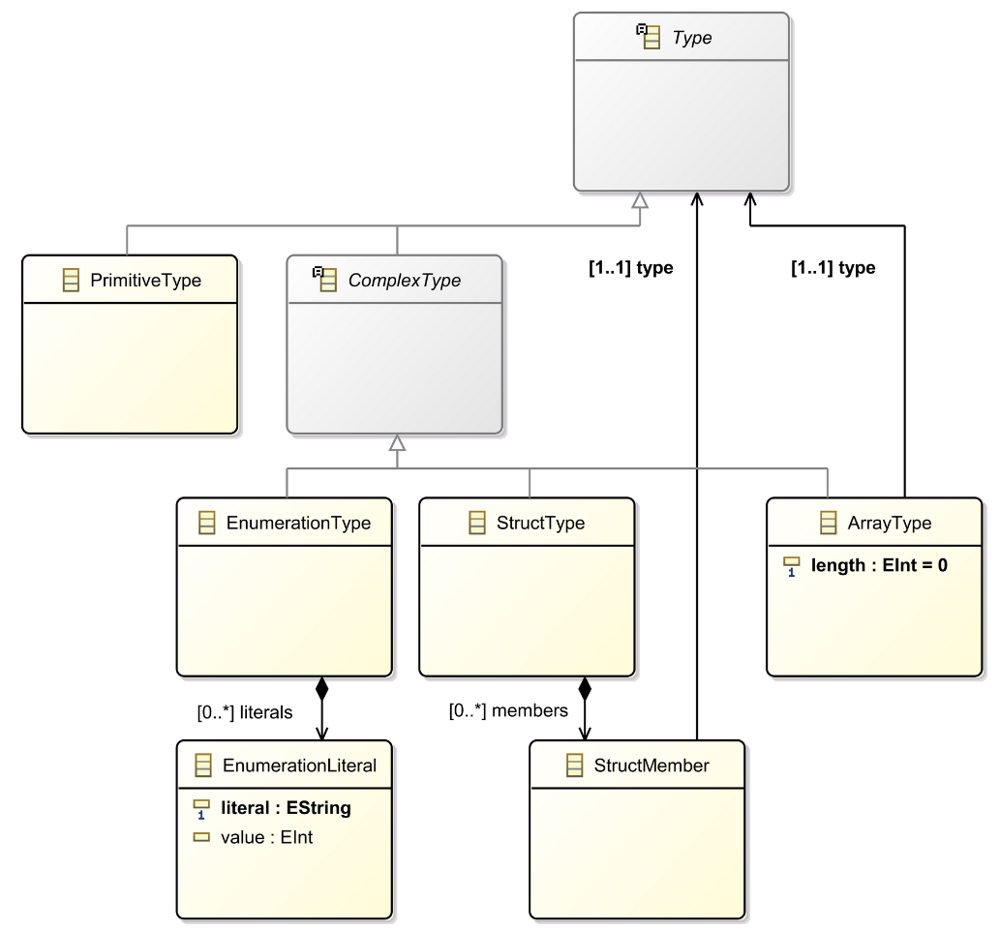
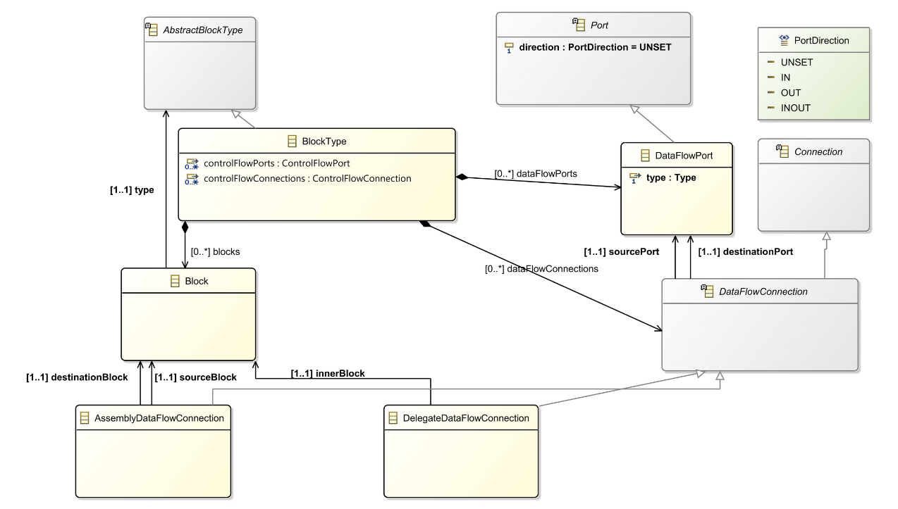
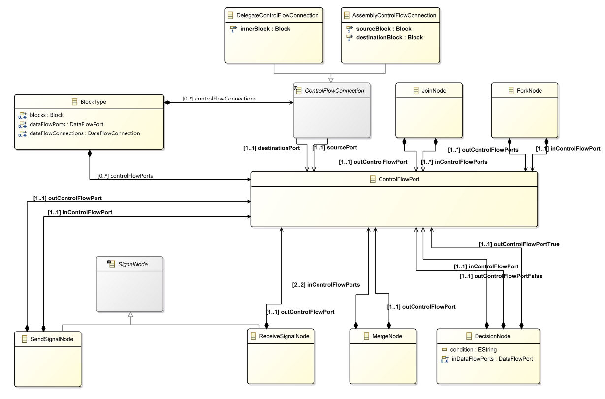
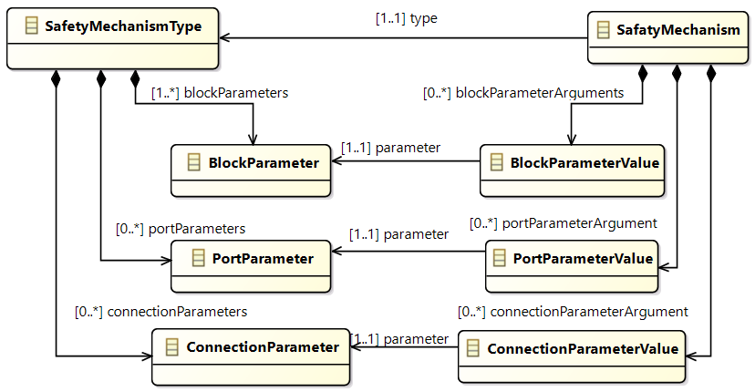
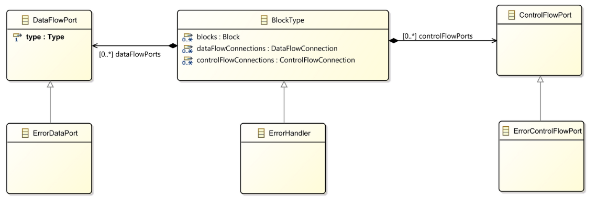
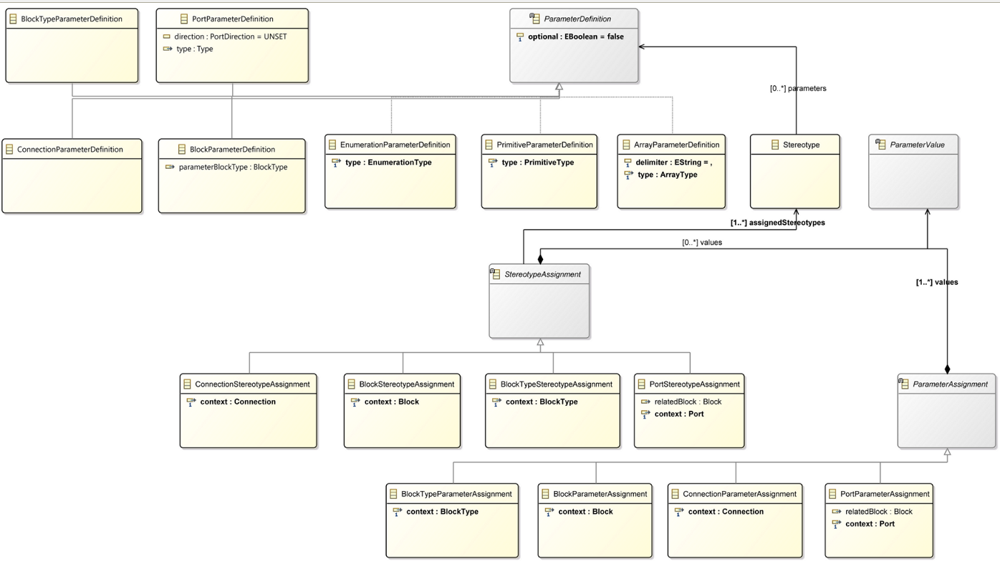

{}

Here we give a brief overview of the main concepts ofthe USF metamodel.

{}

{}

This metamodel is the foundation for all tool support and makes sure that all tools are based on the same concepts. These concepts of of the USF Metamodel are outlined below.

{}

{}

# Common Base Classes

The content of the USF Metamodel is stored inside a *Model* which servs as top-level entry point. Further structuring of the contained data can be achieved by using *Packages*. Elements contained by the *Model* or *Package* are classified as *IModelContent*.
Additional to this, two types *DocumentedElement* and *NamedElement* are used to classify types in the USF Metamodel which have a name and/or a documentation.

# Type Concepts

The type concept is used to represent structs, arrays, enumerations, and primitive types. It is used to type Data Ports to further describe the structure of the information transferred via that port. Additional to this it is used in the Parameter concept to define additional values required for the USF model elements.

# Block, Port and Connection Concepts

To represent a system structure or information flow, the concepts of Blocks, Ports, and Connections are used (see also Control Flow Concepts).
Elements of a system are modeled as Blocks and are characterized by a BlockType. Information flow between Blocks are mapped as DataFlowPorts connected via DataFlowConnection. DataFlowPorts can be typed with Types of the USF Type Concepts. The direction of the data flow is specified by the PortDirection.

# Control Flow Concepts

For the modeling of information flow special port and connection concepts are provided in USF. This scopes the focus to separate information- and control flow modeling.
Derived concepts are explicitly focused on control flow. To represent control flow ControlFlowPorts and ControlFlowConnections are used. Additional dedicated Blocktypes for Join, Fork, Merge and Decision are provided to model the control flow. Send and Receive Signal are used to start or consume a control flow and will consume ore emit a defined signal in the system.

# Safety Mechanism Concepts

Safety mechanisms are technical solutions to protect a functional system and are finally included by a model-to-model transformation or model-to-code transformation into the final model or the final code.

To describe safety mechanisms the concept of a *SafetyMeasureType* and a *SafetyMeasure* are part of the metamodel. A *SafetyMeasureType* specifies the template with all the required parameters of a safety measure that are needed for the transformation. 
A *SafetyMechanism* is an instantiation of a *SafetyMechanismType* and is assigned to a block. All parameters defined in the template are filled with concrete values, which can be model elements or strings to configure the transformation which will perform the safety measure on the domain model.

# Error Handling Concepts

Error Handling is derived from the Block Concepts (like the ControlFlow Concept) to scope the focus on error handling. ErrorHandler is a subtype of BlockType and can be used in the system context. ErrorDataPort and ErrorControlFlowPort are specific data and control flow ports used in the context of error handling.

# Stereotype and Parameter Concepts

The Stereotype and Parameter Concept is derived fromUML and can be used extend the vocabulary of USF.Therefore the USF metamodel providesStereotype,StereotypeAssignment,ParamterDefinitionandParameterValue. Stereotype and Parameters can be as-signed to BlockTypes, Blocks, Ports, and Connections aswell as define Safetety Measure inputs during Safety Patterndefinition.

{}

