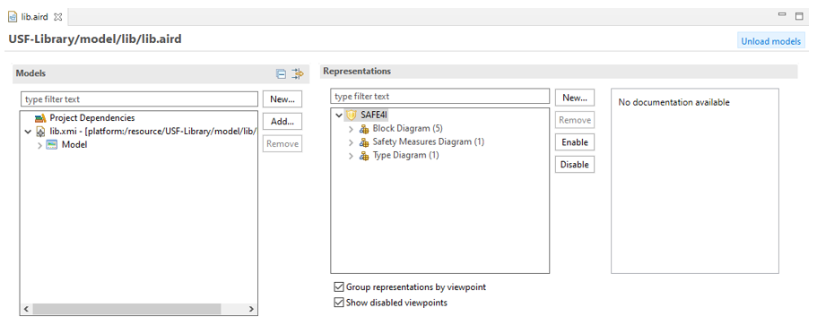
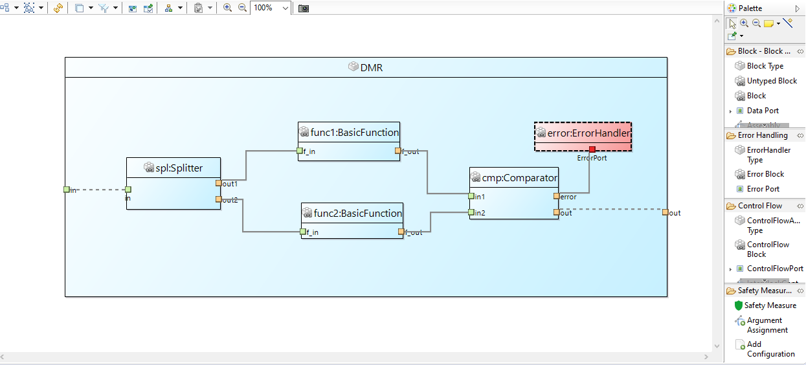
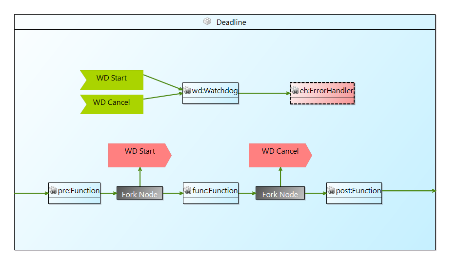
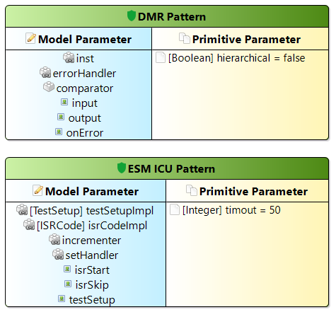
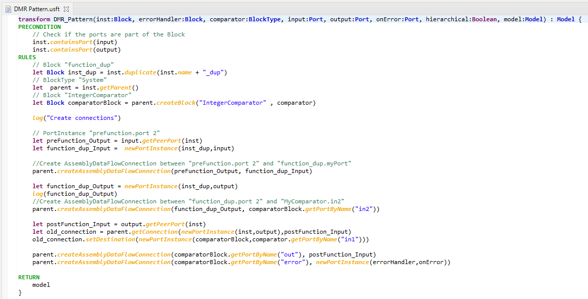
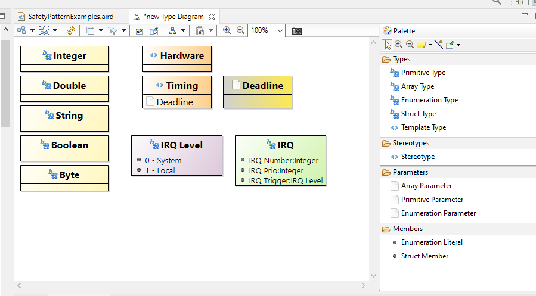
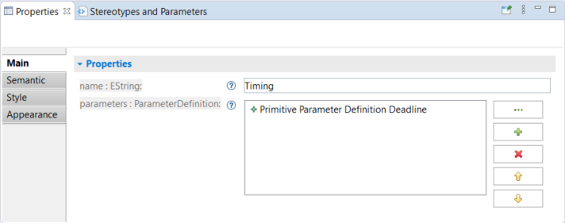

## Overview of the Dashboard

As a starting point, the editor opens a dashboard with a tree view of all model elements and all existing diagrams.

On the left side named Models, a tree representation of the semantic resource (i.e. the USF model file). Here, all model elements are listed with type and name. Also, all diagrams are listed in the tree.
On the right side named Representations, the viewpoints, diagram types and diagrams are listed, grouped by category. Additionally, there is a documentation section, which shows some information of a selected viewpoint or diagram type.
The two checkboxes below the list of diagrams are only relevant, if a representation file uses more than one viewpoint. In the context of USF, the checkboxes can be ignored. 

## Overview of the Block Diagram

The Block Diagram shows blocks, ports and connections of the model.

This figure shows a Dual Modular Redundancy (DMR) modelling as example on how to model blocks, ports and connections to describe an information flow between blocks. Block diagrams can also be used to describe a control flow.  

The tool palette on the right hand side is organized in several groups. Block – Block Type – Port provides tools to create usual blocks, ports and connections to model data flow domain. The section Error Handling offers creation tools for error handling blocks. The section Control Flow provides tools to model the control flow of blocks. This involves blocks to split the control flow, such as Decision Node or Fork Node. Also, with the Send Node and Receive Node, asynchronous control flow can be modelled. The Safety mechanism section offers tools to instantiate a Safety mechanism and assign arguments and add configurations to the safety mechanism instance.

## Overview of the Safety mechanism Diagram

In a Safety Measure Diagram, types of Safety Measures can be defined. A Safety Measure Type specifies all required parameters of a safety measure. Parameters are distinguished into model parameter and primitive parameteter, model parameter are parameter which take a model element as argument while primitive parameter take a simple value as argument (like “true”/false” or “33”). The figure below shows two Safety Measure Types each with a list of parameters. Primitive parameters can define default values which are used for Safety Measure by default if no other value is defined.

The Safety Measure Type provides the interface definition for the transformation it self which is defined via USF Transformation language. There is a context menu action avalible for the Safety Measure Type to navigate to the related transformation (“Show Transformation”). If no transformation is avalible a skellton body will be generated which can then be filled with the transformation instructions.

## Overview USF Transformation Editor

The transformation editor provides textual editing capabilities to write a transformation capturing the steps need to secure the system. The USF transformation language is whitespace-aware similar to Python and all instructions need indentations to separate them from the main concept areas which are transformation name and parameter list, preconditions, rules and return instructions. 

## Overview of the Type Diagram

The Type Diagram is used to visualize Type elements as well as Stereotypes and Parameters.

Types, Stereotypes and Parameters are visualized as blocks. Types and Parameters offer different concrete types, such as primitive or array. They are differentiated by their block colour. Yellow means primitive type, orange is used for array types, enumeration types are coloured purple and struct types are green.
You can assign Parameters to Stereotypes to further enrich your model. To do so, select a Stereotypes and add any Parameter in the Properties View.
The Type diagrams are synchronized, which means, all diagrams show the same elements. Therefore, it is not useful to create more than one diagram of this type. A new diagram is also initialized with all type-related elements, when opened the first time.

## The Properties View

The Properties View is a context-sensitive view, which shows properties of a selected element. For USF elements, primitive properties (such as string properties) and references are listed.

For primitive typed properties, the value in the text field next to the property’s name can be changed. 

Stereotypes and Parameters appear in two different diagrams: In Type Diagrams, they are defined, in Block Diagrams they are assigned. There is an additional section in the properties view to simplify the assignment.
Stereotypes and Parameters are used in the USF to further enhance a model and can be applied to Blocks (e.g. Block, Error Block, Decision Node), Ports and Connections.
Stereotypes are used to enhance the semantics of an element while Parameters are used to add additional properties to an element. Parameters can also be assigned to a Stereotype. If such a Stereotype is applied to an element, all assigned Parameters of that Stereotype will be added to the element, too. The block in Figure 3 9 has one assigned Parameter (Synchronized) and one assigned Stereotype (Timing). Since the Timing Stereotype has a parameter Deadline, this parameter is assigned to the block as well.

The Stereotypes and Parameters section shows assigned Stereotypes and Parameters as well as their values. Parameters can have a default value, which is highlighted with a light-purple background. Values can be edited by simply clicking the respective value.

