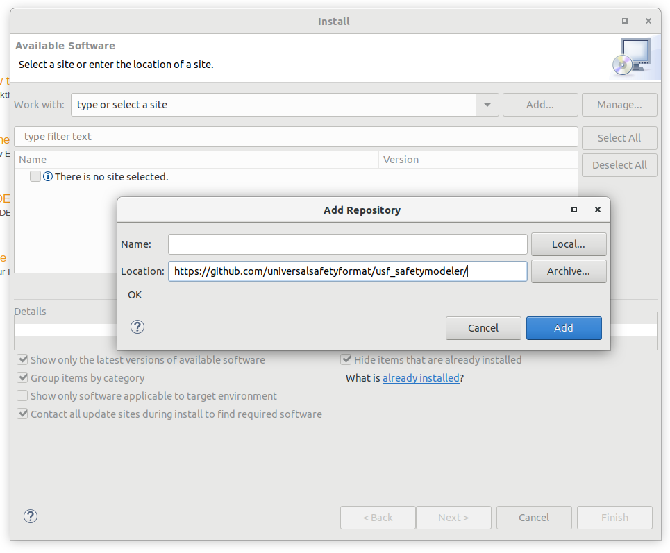

## Installation of the USFedit plugin

The installation requires a running Eclipse Modeling Tools installation, which can be downloaded from https://download.eclipse.org. Eclipse 2020-12 or higher is required to install the plugin.  

To install the USFedit plugin run Install New Software (via Help > Install New Software) in the Eclipse environment.

Add a new repository location and install USFedit from there.
