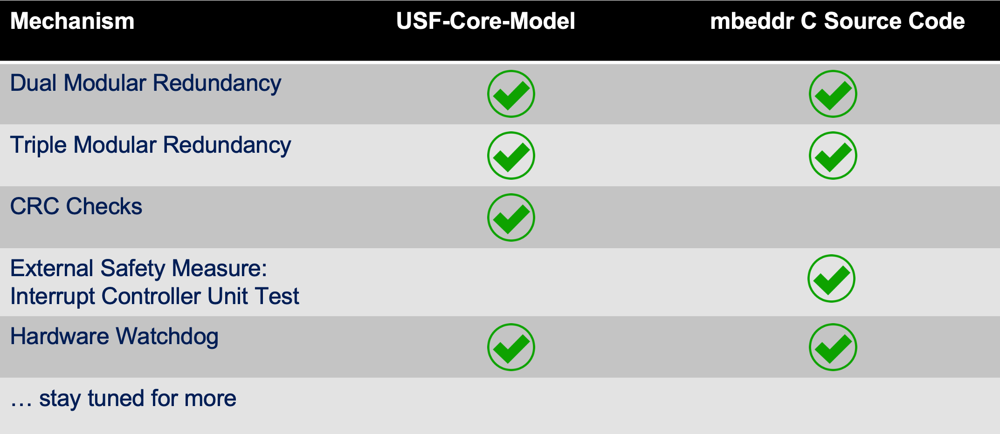

## Welcome to SafetyWeaver

USF allows to create libraries of functional safety mechanisms, e.g., for applying DMR, TMR or Watchdog mechanisms. These mechanisms are defined as model-to-model transformation scripts, using the definitions of the USF meta model (blocks, ports, control flow, etc.). The transformation language is designed such that the mechanisms can be applied on the model level and on the code level. Examples for model-level applications include domain-specific models like SysML hierarchical structures, AUTOSAR components or proprietary component-style architecture models. The main target for the code-level application of safety mechanisms currently is the C programming language. Many safety-critical systems are using C as their implementation language. 

SafetyWeaver is a tool for the application of safety mechanisms, i.e., for executing USF transformation scripts on different domain-specific models or code. The SafetyWeaver tool is based on the tool platform MPS, provided by JetBrains as open-source tooling (link: https://www.jetbrains.com/mps/). Additionally, SafetyWeaver uses the mbeddr (link: http://mbeddr.com) open-source project, which is an extensible C IDE .SafetyWeaver is being developed by the German company itemis (link: https://www.itemis.com/en/it-services/methods-and-tools/). Please contact klaus.birken@itemis.de for further information and demo or evaluation requests. 

## Applying Safety Mechanisms to C-Code

In order to apply safety mechanisms to C-code, the code has to be developed using the mbeddr C IDE or imported as textual C files into mbeddr. In mbeddr’s C editor, code can be annotated in two ways: 

- *Markers* can be added to indicate special locations in the code. 
- *Applicators* can be added to code blocks, in order to specify which safety mechanism should be applied and which information should be used by the transformation. 

Usually, both annotation types will be combined: The parameters of an applicator often specify locations in the code by referring to markers. 
The following screenshot shows a while-loop of C-Code and an annotation which specifies that the APPLY_WATCHDOG2 mechanism should be applied. It uses two markers (InitWD and PetWD) to specify location in the C-code. Two additional parameters (implInit and implTrigger) specify C-domain-specific code snippets, which have been defined using SafetyWeaver’s code block editor (see next section). 

Each applicator or all applicators in a C module can be executed interactively by triggering a context menu action (actually, in MPS these context-specific actions are called intentions). In a production environment, applicators will be executed in batch mode during a build process (e.g., with Maven or Gradle). 
If the applicator in the previous diagram is executed, the resulting code looks like the following: 

TODO

At the relevant locations in the C module, code has been introduced. SafetyWeaver will also take into account required dependencies, e.g., #define statements on module level or additional #include statements. In this simple example, this is quite straightforward. In more complex examples, the control flow of the C code might be altered, which requires more complex restructuring and optimizations. 

Note that SafetyWeaver provides some traceability for the adapted code sections: The safety mechanism which has been applied is still referenced and the materialized code blocks are documented. This traceability information can be extended depending on the specific workflow requirements. It would be also possible to generate a report which specifies which transformations have been applied. 

## Specifying Implementation Details

In order to specify transformations without any references to domain-specific details, it must be possible to specify these domain-specific details in an extra editor. For the domain of C code, SafetyWeaver provides a code block editor. The following diagram shows an example configuration consisting of two code blocks which are needed for the watchdog example discussed previously. 

TODO

The interface for each code block is defined by referencing an USF block type. Usually, this block type is provided as part of the safety mechanism definition (see next section). Comments which have been added to the USF block type definition are shown in the code block editor. This helps the user to understand what functionality should be implemented by the code snippet. 
The control flow ports of the block type represent entry and exit points for the code block. The data flow ports of the block type represent read-only variables (for input ports) and write-only variables (for output ports). The code block editor of SafetyWeaver will enforce these restrictions and show error markers if the code snippet doesn’t comply to the block type definition. 
On the left side of the code block editor, it is possible to specify additional dependencies, i.e., necessary included headers (imports section) and needed global constants (globals section). 

## Defining Safety Mechanisms as Transformation Scripts 

In addition to the application of safety mechanisms to C code and other types of artefacts, SafetyWeaver supports the specification of those safety mechanisms. This can be done by using the editor for the transformation language. The following screenshot shows the implementation of a watchdog safety mechanism. 

TODO 

The implementation may contain USF block type definitions (TriggerWatchdog in the example). This is an elegant means to specify the transformation’s API, but also to use it as a blueprint for constructing new block types. During the construction of new block types, it is possible to provide domain-specific details (see the previous section ‘Specifying Implementation Details’). 

## A Catalogue of Safety Mechanisms 

SafetyWeaver currently already supports a library of different safety mechanisms, as shown by the following table: 

We plan to extend this library continuously by adding new transformation scripts (table rows) and also adding new target domains (columns). 

## Future Extensions 

Although the first release of SafetyWeaver is already available for evaluation purposes, there is a roadmap of future extensions. This roadmap includes the following features: 

- support weaving for real-world, component-based domain models, e.g., SysML v2 
- enhance library of safety mechanisms aka transformation scripts 
- support latest extensions of USF, e.g., hardware deployment 

The last feature (hardware deployment) would allow to specify safety mechanisms which use hardware resources. One example of this is the mapping of redundant control flows onto different cores, thus enforcing hardware redundancy. Another example would be the implementation of watchdogs by using hardware timers.

