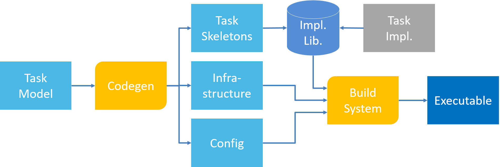
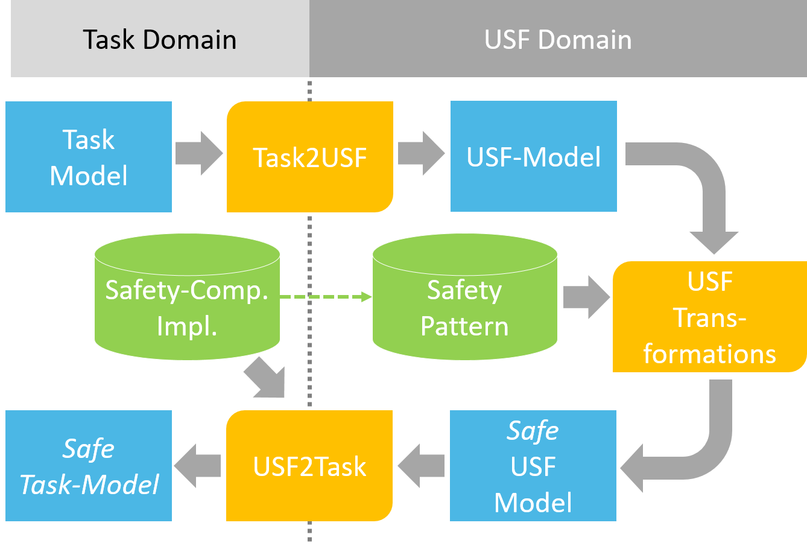

## Task-Level Design
The task-level design tool implements a model-driven design approach to generate code and configurations for supported embedded RTOS based on a task-level model. The task model is an extension to SysML and specifics the different functions that should run as tasks on an embedded platform, their interaction between each other as well as with the interfaces of the system. The image below shows the design flow of the tool. Based on the model, code is generated for the instantiation of task and the infrastructure for the inter-process communication, as well as the configuration for the build system. The implementations for the tasks are stored in a library. For new tasks, the tool will generate a skeleton code, which can then be extended with an implementation.

## USF Extension
The Universal Safety Format enables the task-level design tool to automatically integrate software safety mechanisms selected by the user directly into the task model. For this, the task design is first translated into a corresponding generic USF model, which can be then be enriched with safety mechanism by applying safety pattern from a library via the USF transformation. The resulting enriched USF model is then translated back into the task model containing the software safety mechanism. By suppling a target-specific implementation for parts of the mechanism via the safety component implementation library, the code can be fully generated without requiring any user interaction and therefore fully automating the realization of the safety mechanisms.

