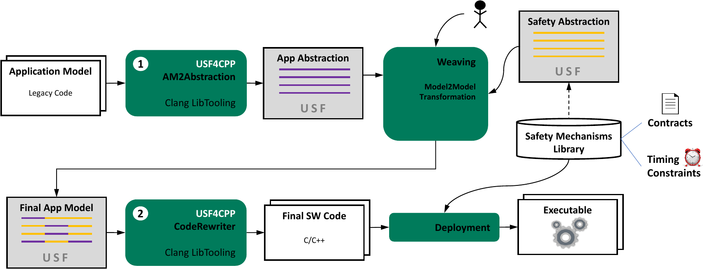

The ideas of the Universal Safety Format are applicable to various programming languages. One of them is C++. In order to study the compatibility between USF and C++, USF4CPP was created. It is a prototypical implementation that enables the user to utilize the advantages of USF for their C++ project. USF4CPP also shows how one can make use of existing compiler technologies with the purpose of supporting USF. 

USF4CPP offers two main functionalities. One is to take the applications source code and create a USF model on the basis of it. This step is called AM2Abstraction. The other functionality of USF4CPP handles the way back – it takes final USF application model (which is probably annotated with several safety mechanisms) and translates it back to source code. This part is simply called CodeRewriter. 

A potential use case for USF4CPP is shown in the figure below. Starting in the upper left corner of the figure, an existing code base is abstracted in step 1 by AM2Abstraction. The result is an application abstraction based on the USF meta model. This abstraction is presented to a safety engineer, most probably in a graphical way with tools like USFEdit. The engineer can then annotate parts of the application that should be safeguarded by certain safety mechanisms. It is also thinkable to offer tools which facilitate query-like statements that automatically match safety mechanisms to parts of the application abstraction. Eventually, the result of the weaving process is a final application model which is made of the application abstraction and the annotated safety mechanism abstractions. This final model is given to the CodeRewriter. A source-to-source transformation manipulates the initial application code by adding source code of the safety mechanism library. The resulting software code would then be linked with the respective safety mechanism libraries and afterwards be deployed as usual. 

The technical foundation of USF4CPP is the tooling infrastructure of Clang (the C language family frontend for LLVM). AM2Abstraction uses AST matchers and source-level control flow graphs of LibTooling for creating the USF compatible application abstraction. The CodeRewriter is also based on LibTooling and utilizes the Clang Rewriter class to perform the desired source code alterations.
