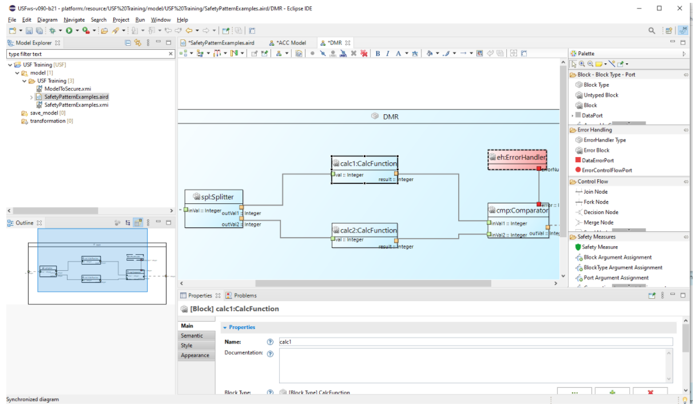

## Views in USFedit

The USF Editor consists of several views showing different aspects of a USF model. Most views can be accessed from the editor’s *dashboard*. The *Block Diagrams* and *Type Diagrams* show graphical aspects of the USF model. The *Properties* view and *Stereotype and Parameters* view show non-graphical properties of model elements.

The *Block Diagram* view and *Type Diagram* view share a similar setup. On the left side is a big canvas located, where model elements are displayed as boxes and connections. This diagram area offers on the top a toolbar with some tools for the visualization of the diagram, such as zoom and layout tools. On the right side there is a palette of tools. Those tools can be used to create new model elements (e.g. blocks, ports or connections). Tools are organized by categories for a better overview. 

More information on how to use the editor can be found on the following pages:

- [Installation](/tools/usfedit/installation)

- [Editor UI](/tools/usfedit/editor_ui)

- [Getting Started](/tools/usfedit/getting_started)

- [Import Models](/tools/usfedit/import_models)

- [Troubleshooting](/tools/usfedit/troubleshooting)
 

