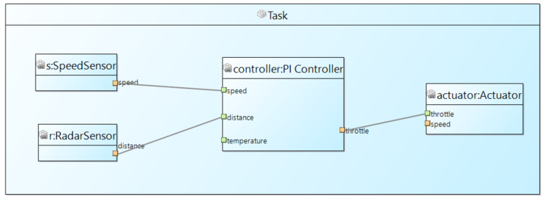
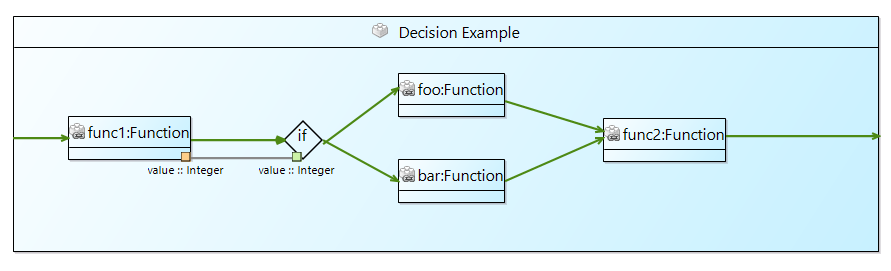
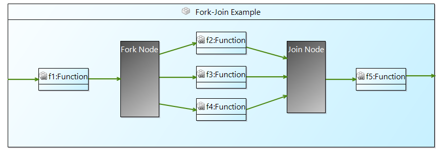
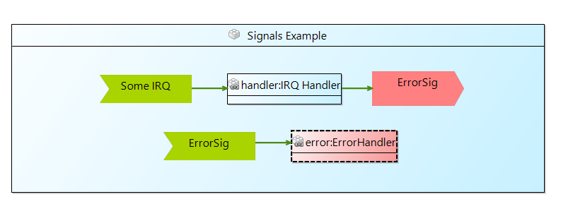
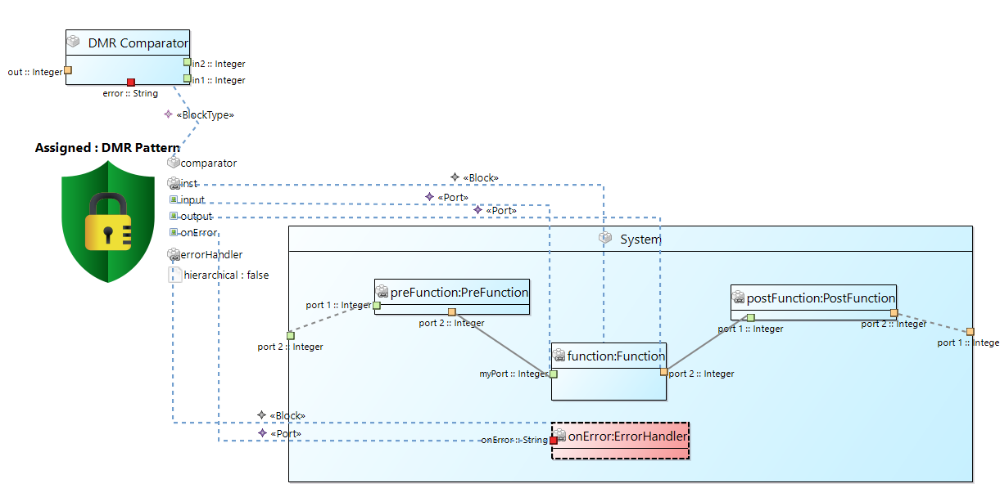
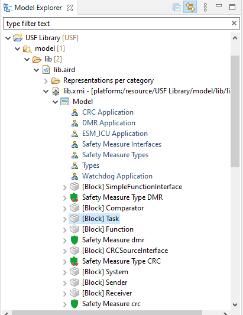

## Creating a USF Project

To create a new USF project, choose from the File menu New, and then Other… 

In the upcoming dialog search for a Wizard named USF Project (figure below). Select the wizard and click next, enter a project name and click Finish. This will create a new USF project in your default workspace.

## Initializing a USF Model

After creating a USF project, you can set up a new USF model in order to examine the other functions of the USF Editor. To generate the new model files, select any USF project, right click and choose the USF submenu. Here, you can select a command to create an empty model (New Model).
In the opening dialog, select any USF project and enter a model name. In the model folder, each model file resides in a subfolder.
A representation file will be created next to your model file. In the Model Explorer View, you can double click the representation file (*.aird) to open the editor dashboard.

In the dashbord you can open existing diagrams and create new ones.

## Working with Block Diagrams

Use the dashboard to open existing diagrams and to create a new Block Diagram. 
To create a new diagram, simply double click  the respective category. For instance, to create a new Block Diagram, double click the Block Diagram entry. Alternatively, you can click the New… button, which will open a dialog to select the respective diagram type. Next, a dialog will open, where you can select the semantic root element of the diagram (i.e. the USF model) and enter a name for the new diagram. Then, the diagram view will be opened and you can start to create a new diagram.
Existing diagrams can be opened with double click on the diagrams name.

### Working with data flows

Assume a simple functional model showing the cooperation of sensors and controller to control an engine. In the example shown in the following figure there are four Block Types (SpeedSensor, RadarSensor, Controller, and Actuator, all on the top). All block types define certain data ports for representing data values.

Instances of those Block Types are shown in the Task container (which is technically also a Block Type containing the shown blocks). A block derives its ports from its type. Since the actuator block is untyped, there are no ports. Furthermore, untyped blocks are drawn grey, so they are easy to find.
To assign a Block Type to a Block, use the Properties view. Select the actuator block and in the Properties view, click the [...]  button next to type.

A dialog will open, where the desired type can be selected. The dialog shows all elements of the underlying model. Search for the entry Block Type Actuator and confirm your selection. The type will be set for the block and the diagram will be updated with the respective ports.

Finally add data flow connections can be added to show, which blocks use which data. To achieve this, use the Assembly Connection tool from the Block – Block Type – Port tool palette. For every data flow, select the involved ports. Each pair of two will create a new data flow connection. For instance, to establish the connection from the speed sensor to the controller, select the Assembly Connection tool, then click the orange out port of the speed sensor block and then the green speed in port of the controller block. Repeat this with other used ports. Note, that not all ports have to be used. E.g. the temperature port of the controller is not used in this example

### Working with control flows

Similar to the work with data flows, control flows are represented with blocks. Since control flow can be more complex, there are a few more Block Types, which can be used.
There are three types of a split control flow: Decisions, synchronous and asynchronous control flow. Decisions are typically if-else branches, which allow different control flows based on conditions. Condition Nodes are used in this case, see figure below. Block func1 provides a value for the decision node (if). If this block evaluates a condition to true, the upper path will be executed (i.e. block foo), if it evaluates to false, the lower path will be executed (i.e. block bar). Block func2 merges the two control flow branches.

Synchronous control flow is usually used to represent the parallel work of multiple tasks. A Fork node is used to split the control flow is as many paths as you want. A Join node synchronizes the control flows and joins all paths back into one, as seen in the following figure.

To model asynchronous control flow or the reaction on certain signals, the Send Nodes and Receive Nodes can be used. They are intended to react on signals sent by other elements or even external libraries and hardware. The example in the figure below contains two Receive Nodes. One listens for the signal (external) Some IRQ, the other for ErrorSig. A signal not necessarily needs to be sent in the same block context. Receive Nodes can also act as multiple entry points for a control flow, like in this example. In such a case, there is no Assembly Controlflow Connection required.

Note: To connect the in port of the (outer) block type with the in port of the first executed (inner) block, you have to use a Delegate Controlflow Connection (from the Control Flow tool palette). To connect in and out ports of (inner) blocks, use the Assembly Controlflow Connection.

## Working with Stereotypes and Parameters  

Stereotypes and Parameters are available in Block Diagrams and Type Diagrams. While Stereotypes and Parameters are created in a Type Diagram, in the Block Diagram they become assigned.
To create a new Stereotype or Parameter, open a Type Diagram. In the Tool Palette, you can choose to create either a Stereotype or a ParameterDefinition. ParameterDefinition differentiate between Array-, Primitive-, and EnumerationParameterDefinition. In the Properties View, one or more Parameters can be assigned to a Stereotype. Also, one Parameter can be assigned to multiple Stereotypes.

In the figure above two Parameters (Clocked and Timeout) and one Stereotype (Deadline) are shown. Parameters which are used by a Stereotype can be seen in the diagram as well as in the Properties view.

TODO: Verwendung von Stereotypes in Block Diagrammen!!

## Working with Safety Mechanisms

Safety mechanisms are available in Block Diagrams and Safety mechanism Diagrams. To define a Safety mechanism Type, one or more related BlockTypes are needed to define the signature of the Safety mechanism. Think of the DMR pattern shown in the following figure. The secured block should be doubled. To perform this operation parameters like the “block to secure” its ports as well as error handler and comparator for the output values are required. The figure below shows and example setup for the DMR pattern which serves the signature definition for the transformation.

Parameters enhance a Safety mechanism Type further. A parameter can define a default value. Primitive Parameters specify either integer, string or boolean values. Optional parameters have not to define a value at all.
When the definition of a Safety mechanism Type is complete, Safety mechanism instances can be created. This is done in the Block Diagram but could also be done programmatically during a binding phase.
To add an “instance” of the DMR pattern (as shown in Figure 4 12), create a new Safety mechanism in the Block Diagram (see Figure 4 13). Choose Safety mechanism from the tool palette (step 1). Then click on some free space in the diagram (step 2). The Create a new Safety mechanism dialog opens and you can enter some name and select the Safety mechanism Type for the new instance. Click OK to finish the creation (step 3).

To add an “instance” of the DMR pattern (shown in the figure above), create a new Safety mechanism in the Block Diagram (see figure below). Choose Safety mechanism from the tool palette (step 1). Then click on some free space in the diagram (step 2). The Create a new Safety mechanism dialog opens and you can enter some name and select the Safety mechanism Type for the new instance. Click OK to finish the creation (step 3).

Next, the new instance is added and shows all required arguments.

If you want to set or override values of a pattern’s parameters, you can select the parameter and use the Properties view.

## Defining a Transformation

After creating a SafetyMeasureType it is possible to create/navigate to the transformation describing the steps which need to be performed to secure the system. There is a context menu command available for the SafetyMeasureType (“USF->Show Transformation”) which will initialize a transformation file located in the USF Project if no transformation was specified or just opens the transformation if it is already present. The initial created transformation file will already contain the specified parameters defined for the SafetyMeasureType but needs manual synchronized later on (at the moment) if they are changed in the SafetyMeasureType. The following figure shows the DMR transformation as an example.

### Execute the transformation

After specifying the SafetyMeasureType, the transformation, the SafetyMeassure instance and all parameters are assigned to values (arguments). It is possible to execute the transformation by using the context menu command available for the SafetyMeasure “instance” (“USF->Execute Transformation”).  
If the transformation is successful a model (*.xmi file) is created in the project under the “save_model” folder which contains the secured model. The model can be directly examined, or a diagram view can be initialized for it. To create a Diagram view it is required to create a new .airid file which can be done via context menu for the *.xmi file “New->Representations File”. Just press “Finish” in the Wizard which should create a *.arid” file next to the selected *.xmi. After this the *.aird file can be use in the same way as already explained in chapter 4.2. Drag and drop the parts of interest in a canvas of a new diagram, deselect anything (just click in the canvas) and press “Arrange All” in the toolbar of the diagram editor.

## Using Template Types and Type Inference

To support reuse and to enable a generic way of modelling, USF supports Template Types. This is, a generic type, which is used as placeholder for a concrete type and is assigned depending of its context. For instance, think of a component, which should be used in different contexts but only modelled once (like a comparator block which checks duplicated input). Instead of creating several nearly identical BlockTypes (only differing in the port types), one generic BlockType with one or more TemplateTypes can be used.  
Template Types appear in the Types Diagram and in the Block Diagram. To create a TemplateType the Types Diagram is used. Assigning a TemplateType to a Port is done in the Block Diagram. In the figure below you see an example of some type definitions in a Type Diagram.

How to use those Types is shown in following figure.  The block c:Checker offers two ports with the same template type. In context of UC 1 the input port is connected with an int port. In context of UC 2 the input port is connected with a float port. So, a generic Checker BlockType can be used in different situations.

To derive the actually used types, USFedit provides the command Infer Types. To execute the command, a BlockType or model file has to be selected!

The command will infer types by the context of template typed ports and print the report in the console view. Additionally, Template Assignments will created for every port, where a type could be inferred. For the above example, the report is shown in the following figure. Note, that only the input ports of the c:Checker blocks are assigned but not the result ports. That’s because of missing context of the result ports. Note also, that one Template Type on one block can have only one resolved concrete type. So in the above example, the result ports would have to match the input ports, since both use the same Template Type! Otherwise, the report will state, that the Template Type is ambiguous.

Beside the report, two Template Assignments were created. Details of a Template Assignment are shown in the Properties View. It is seen, that the assignment is connected to the int port in UC 1 and so the inferred type is int. 

## Drag’n’Drop existing elements into a diagram 

Reusing existing model elements is quite easy and works with any diagram editor. The Project Explorer view (usually on the left) lists all files of a project. For all USF models, there are two resources: an XMI file containing the semantic model and one AIRD file, which stores the visual representation of the semantic model.  
In the Project Explorer, the AIRD file can be expanded and lists all available diagrams as well as all model elements.

Selecting a model element and dragging it to a Block Diagram will add this element to the diagram.

