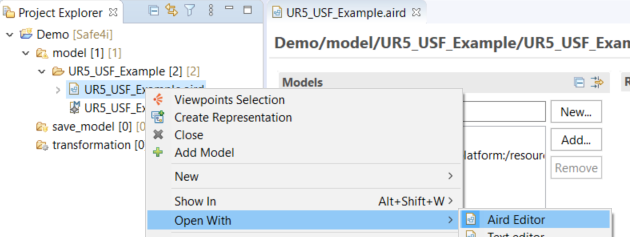
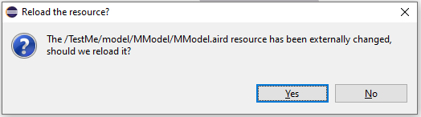
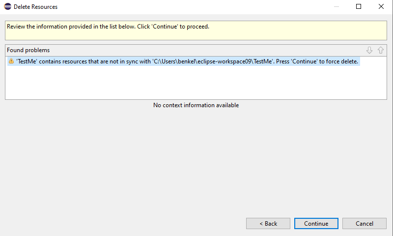

## Double click the AIRD file does not open the Dashboard

Sometimes, the AIRD file will not open when double clicking it. In this case, right click on the AIRD file, choose Open With > Aird Editor (figure below). This should open the editor right away.

## Saving a Diagram requests a ‘Reload the resource’

Occasionally a dialog to reload the resource pops up when saving a diagram.

Press yes, because otherwise the changes in the diagram are lost.

## Request to Delete Resources

Deleting a project sometimes requests to delete resources.

Press Continue to finish.